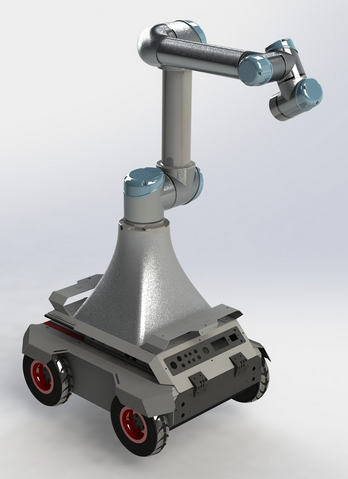

## Theme - Sahayak Bot (Assistance Robot)

The theme that we got was Sahayak Bot. We had to program an Autonomous Ground Vehicle (AGV) to make it capable of autonomously traversing an indoor environment to assist moving objects from one place to another. The scenario was that objects were being moved in e-Yantra’s lab and they were short of manpower so Sahayak bot was used to help move the boxes from one place to another.

Challenges in this theme inlcuded: 2D mapping, 3D mapping, Autonomous Navigation, Perception, Pick and Place.

<!--  -->

Our performance:

|               | Objectives                                                                                                                                                                                                                                                                                                                                                                  | Score                                               | ~ No. of teams who completed the task |
|---------------|-----------------------------------------------------------------------------------------------------------------------------------------------------------------------------------------------------------------------------------------------------------------------------------------------------------------------------------------------------------------------------|-----------------------------------------------------|:-------------------------------------:|
| <b>Task 0</b> | To get familiar with Ubuntu & ROS                                                                                                                                                                                                                                                                                                                                           |                       Accepted                      |                  330                  |
| <b>Task 1</b> | To get an overview of Gazebo                                                                                                                                                                                                                                                                                                                                                |                      87.33/100                      |                  270                  |
| <b>Task 2</b> | To explore Mapping and Navigation in ROS                                                                                                                                                                                                                                                                                                                                    |                      90.05/100                      |                  179                  |
| <b>Task 3</b> | To explore Robotic Arm Manipulation in ROS using MoveIt motion planning framework                                                                                                                                                                                                                                                                                           |                       100/100                       |                  139                  |
| <b>Task 4</b> | To perform Perception                                                                                                                                                                                                                                                                                                                                                       |                       100/100                       |                   70                  |
| <b>Task 5</b> | To collaborate learnings of all the previous tasks ie. - Navigate to the correct location to pick up objects  using the Navigation pipeline - Detecting objects using perception pipelines - Grasping objects with MoveIt planner - Navigate again to your destination using the Navigation pipeline - Placing the objects in the correct drop box |                      31.42/100                      |                   45                  |
| <b>Task 6</b> | Final task Similar to task 5 with added constraints like 48 hours time-limit, original and bonus configuration                                                                                                                                                                                                                                                              | Original 625.8 Bonus 151.67  Code 100/100 |                   41                  |

Eyantra's original repo [link](https://github.com/vishalgpt579/sahayak_bot)
